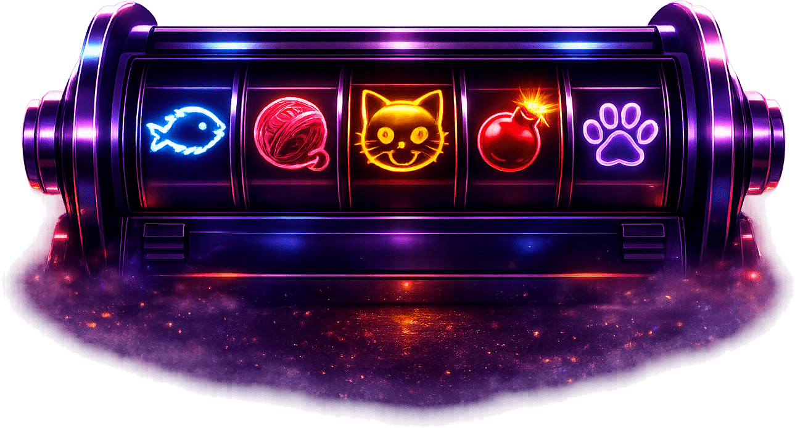

<p align="center">
  
</p>

# CatSpin Arena

Realtime multiplayer slot arena built as a TypeScript monorepo.

<p align="center">
  
</p>

## Workspace layout

- `apps/server` — HTTP + WebSocket server, room lifecycle, match orchestration
- `apps/web` — browser client
- `packages/core` — deterministic game rules and slot resolution
- `packages/protocol` — shared network contract and DTOs
- `packages/shared` — shared utilities and constants

## Quick start

```bash
pnpm install
pnpm dev:server
pnpm dev:web
```

## Next steps

1. Implement room creation and join flow in `apps/server`
2. Wire client/server messages through `packages/protocol`
3. Move betting, payout and win-condition logic into `packages/core`
4. Render lobby and round state in `apps/web`
